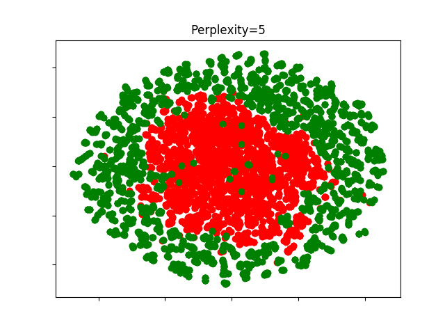
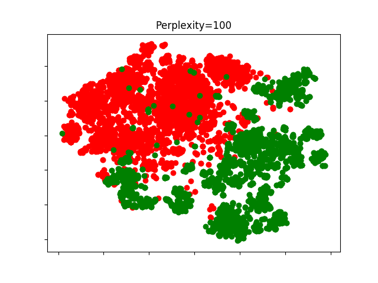
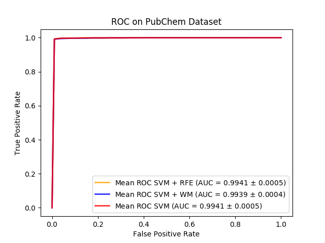
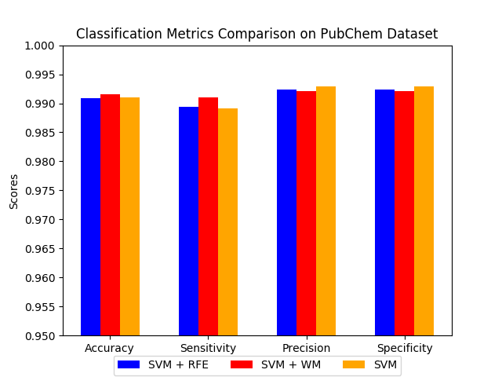

# Drug Discovery Feature Selections

Experiment replication of Rahman Pujianto master thesis research (Universitas Indonesia, 2017).

## Dataset Preparation

Prepared (trainable) datasets are provided in `dataset/dataset.tar.gz`. Information below are provided as an additional information on how to prepare the dataset from raw sources (`*.sdf` or `.mol2` files).

Required tools:

* OpenBabel http://openbabel.org
* PaDEL Descriptor http://www.yapcwsoft.com/dd/padeldescriptor/

Extracting positive (label = 1) training data:

1. Convert `sdf` to `mol2`: `obabel ../dataset/pubchem-compound-active-hiv1-protease.sdf -O ../dataset/pubchem-compound-active-hiv1-protease_mol2/hiv1-protease.mol2`
1. Convert `mol2` tp `csv`: `java -jar PaDEL-Descriptor.jar -2d -addhydrogens -removesalt -dir ../dataset/pubchem-compound-active-hiv1-protease_mol2/ -file ../dataset/pubchem-compound-active-hiv1-protease.csv`

Extracting negative (label = 0) training data:

1. Convert `sdf` to `mol2`: `../dataset/obabel decoys_final.sdf -O ../dataset/decoys_final_mol2/decoys_final.mol2`
1. Convert `mol2` tp `csv`: `java -jar PaDEL-Descriptor.jar -2d -addhydrogens -removesalt -dir ../dataset/decoys_final_mol2/ -file ../dataset/decoys.csv`

Extracting test data (unlabeled):

1. Convert `mol2` tp `csv`: `java -jar PaDEL-Descriptor.jar -2d -addhydrogens -removesalt -dir ../dataset/HerbalDB_mol2/ -file ../dataset/HerbalDB.csv`

## Dataset Description

Datasets provided in this repo:

1. `dataset/dataset.tar.gz`: 
    1. `dataset.csv`: 3,665 HIV-1 protease inhibitor from PubChem Bioassay + 3,665 protease decoy DUD-E for HIV-1 (Mysinger, Carchia, Irwin, & Shoichet, 2012)
    1. `dataset_test.csv`: 10 from top 10 protease inhibitor herbal database Indonesia (Yanuar et al., 2014)
1. `dataset/daftar-senyawa-beserta-binding-energy.csv`: docking results of 368 molecules from herbal database Indonesia (Yanuar et al., 2014) which are predicted as HIV-1 protease inhibitor by machine learning model in this research

> Raw datasets (`*.sdf ` and `*.mol2`) can be downloaded at https://drive.google.com/open?id=1X_wkpvSLXXXUPbxmFd7tE5pe0t_njMe_

## Experiments

Dependency:

* Python 3.x
* Python3-tk (on ubuntu `sudo apt install python3-tk`)
* Virtualenv (optional. for isolated environment)

Dependency library installation: `pip install -r requirements.txt`

Steps:

1. Extract preprocessed data from `dataset/dataset.tar.gz` (if you have raw csv data, use `python 01-prepare-data.py`)
1. Feature selection with SVM-RFE `python 02-feature-selection-svm-rfe.py` 
1. Feature selection with Wrapper Method (GA + SVM) `python 02-feature-selection-wm.py`
1. Evaluate selected features using PubChem dataset `python 03-evaluate-1.py`
1. Evaluate selected features using Indonesian Herbal dataset `python 03-evaluate-2.py`

> Evaluation scripts display accuracy scores in console, save raw results in `csv` files and display result chart(s) to screen

## Some Results

PubChem dataset visualizations using [t-SNE](http://scikit-learn.org/stable/auto_examples/manifold/plot_t_sne_perplexity.html#sphx-glr-auto-examples-manifold-plot-t-sne-perplexity-py). Generated by running `python visualize-dataset.py`:






Comparisons between Linear SVM (no feature selection), Linear SVM + RFE & SVM + Wrapper Method (WM) classification metrics on PubChem dataset. Generated by running `python 03-evaluate-1.py`:





## Citation

```
@mastersthesis{pujianto2017thesis,
	author={Rahman {Pujianto}},
    title={Drug Candidates Virtual Screening on Indonesian Herbal Plants Database using Machine Learning and Various Feature Selection Strategies},
	school={Universitas Indonesia},
	year={2017},
}
```
